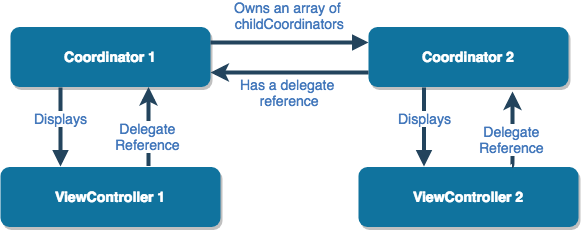
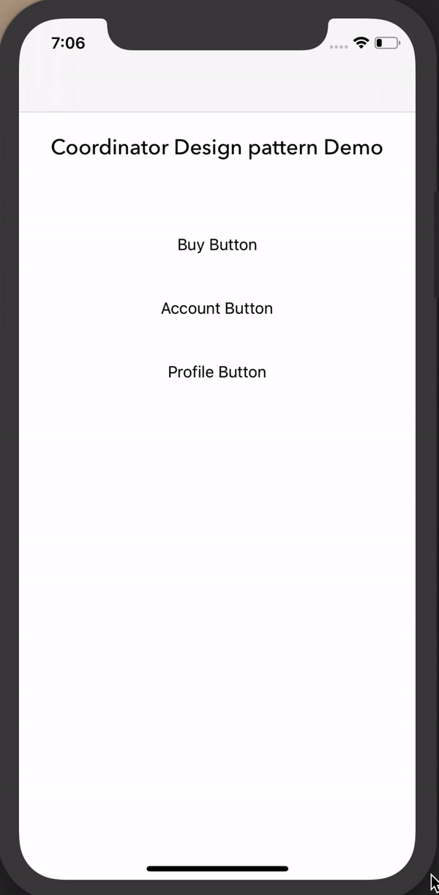

# CoordinatorDesignPattern
Demo of Coordinator design pattern.

## Purpose
_DropDownMenu_ is repo for How to use the coordinator pattern in iOS apps

## Authors
- Tushar Jaunjalkar

## What you will learn:
- Coordinator design pattern
- Swift 5.0
- Storyboards
- iOS Transitioning APIs

## Coordinator pattern in Swift
- Coordinator pattern is defined by Soroush Khanlou.
- Instead of pushing and presenting your ViewControllers from other view controllers. All the screens navigation will be managed by coordinatos.
- The coordinator pattern in iOS apps lets us remove the job of app navigation from our view controllers, helping make them more manageable and more reusable, while also letting us adjust our app's flow whenever we need.

# Flow

## Demo

